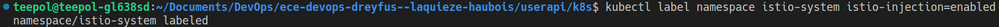

# ece-devops-dreyfus--laquieze-haubois

## Repository Devops

---
Etudiants:

- Haubois Cyril
- Dreyfus--Laquièze Nicolas

Promotion 2024 SI TD 4

---

## Projet DevOps

L'objectif de ce projet est d'implémenter des des outils utilisant des notions du cycle DevOps. Cela débute avec une application basé sur Nodejs avec l'utilisation d'une base de données Redis pour stocker les données, mais aussi de réaliser des tests.

Dans ce repository se trouve les éléments suivants:

1. Une User API Web
2. Application de la CI/CD Pipeline
3. Configuration d'un environnement virtuel avec Vagrant et Ansible pour une approche IAC (Infrastructure As Code)
4. Une image Docker de notre application
5. L'utilisation des `containers` via Docker Compose
6. L'organisation de nos Docker via Kubernetes
7. Début d'utilisation de Istio

## 1. User API Web

Notre application réalisée avec [NodeJS](https://nodejs.org/en/) utilise une base de donnée [Redis](https://redis.io/)

1. [Lien pour installer NodeJS](https://nodejs.org/en/download/)
2. [Lien pour  Redis](https://redis.io/download) (Ne pas hésiter à chercher des tutos pour l'installation en cas de problème)

### Installation de notre application

Il faut aller dans le dossier `userapi/` et lancer la commande suivante:

```bash
npm install
```

Par la suite, pour lancer notre server web, il faut effectuer la commande :

```bash
npm run start
```

Cela devrait normalement lancer l'application web à l'adresse: <http://localhost:3000/>

## 2. CI/CD Pipeline

### Intégration Continue: CI

Nous avons mis en place une intégration continue des workflow grâce à [GitHub Actions](https://docs.github.com/fr/actions)
Avant chaque déploiement, des test sont réalisés pour s'assurer que le code fonctionne bien

### Déploiement Continu: CD

Nous avons mis en place le déploiement continu avec [Azure](https://azure.microsoft.com/fr-fr/)
Cela nous permet d'avoir un apercu de notre projet.

`ici faudrait mettre des captures du déploiement et des workflow de githubactions`

## 3. Configuration de l'environnement virtuel avec IAC

Pour ce projet, nous avons utilisé [Vagrant](https://www.vagrantup.com/) pour l'utilisation d'une VM (utilisation de VirtualBox). Tandis que pour le provisionnement de la VM, nous avons utilisé [Ansible](https://www.ansible.com/)

### Installation

- [Installer Vagrant](https://developer.hashicorp.com/vagrant/docs/installation)

### Utilisation

Il faut aller dans le dossier `\iac` et lancer les commandes suivantes

```bash
vagrant init
vagrant up
```

A présent que la VM est lancée,

## 4. Image Docker de notre application

Nous avons créé une image Docker de notre application.

### Installation

- [Installer Docker](https://www.docker.com)

#### Utilisation

Pour lu'itilisation de Docker, il faut réaliser la commande suivante:

```bash
docker build machin truc
```

On peut aussi observer notre image docker sur Docker Desktop.

`Capture d'écran`

Pour vérifier nos images docker, il faut saisir la commande suivante:

```bash
docker images
```

Par la suite pour lancer le `container`:

```bash
docker run -p ...
```

Pur observer si tout fonctionne correctement et que le `container` est toujours en cours d'exécution. La commande à saisir est :

```bash
docker ps
```

Pour arrêter le `container`, la commande à saisir est:

```bash
docker stop <container_id>
```

## 5. Utilisation des container via Docker Compose

`à compléter`

## 6. Utilisation de nos docker via Kubernetes

`à compléter`

## 7. Début d'utilisation de Istio

### Pour les phases de test

A partir de la racine du projet, lorsque nous exécutons la commande suivante:

```bash
npm run test
```

Les différents tests dans notre projet devraient être réussis comme sur la capture d'écran ci-dessous.

Pour Istio : `export PATH=$PATH:/home/teepol/istio-1.16.0/bin` ce chemin ne marche que dans le terminal où la commande à été executé et pas dans un autre terminal.


