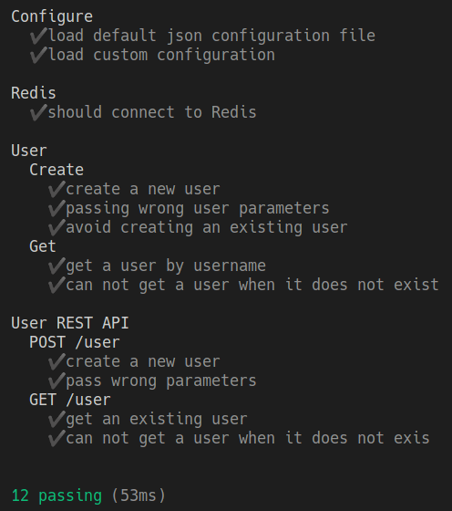
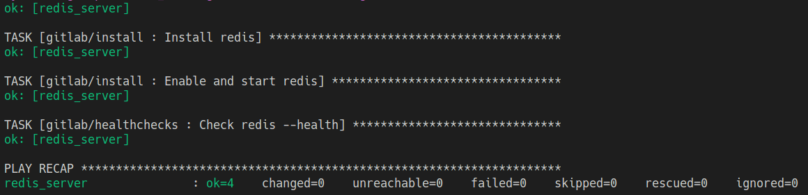
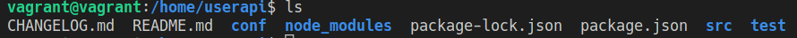
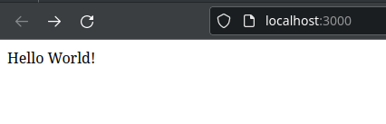
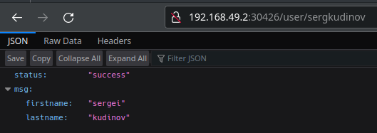

# Projet ece-devops-dreyfus--laquieze-haubois

---
Etudiants:

- Haubois Cyril
- Dreyfus--Laquièze Nicolas

Promotion 2024 SI FR TD 4

---

## Projet DevOps

L'objectif de ce projet est d'implémenter des outils utilisant des notions du cycle DevOps. Cela débute avec une application basé sur Nodejs avec l'utilisation d'une base de données Redis pour stocker les données, mais aussi réaliser des tests.

Dans ce repository se trouve les éléments suivants:

1. Une application User Web API
2. Application de la CI/CD Pipeline
3. Configuration d'un environnement virtuel avec Vagrant et Ansible pour une approche IAC (Infrastructure As Code)
4. Une image Docker de notre application
5. L'utilisation des `containers` via Docker Compose
6. L'organisation de nos Docker via Kubernetes
7. Début d'utilisation de Istio
8. Explication concernant la dernière partie du projet

## 1. User API Web

Notre application réalisée avec [NodeJS](https://nodejs.org/en/) utilise une base de donnée [Redis](https://redis.io/)

1. [Lien pour installer NodeJS](https://nodejs.org/en/download/)
2. [Lien pour installer Redis](https://redis.io/download)

### Installation de notre application

Il faut aller dans le dossier `userapi/` et lancer la commande suivante:

```bash
npm install
```

### Utilisation de l'application

Par la suite, pour lancer notre server web, il faut effectuer la commande :

```bash
npm run start
```

Cela devrait normalement lancer l'application web à l'adresse: <http://localhost:3000/>

Pour essayez notre application vous pouvez créer un utilisateur en envoyant une requête dans un terminal différent de celui où est lancé notre application.

```bash
curl --header "Content-Type: application/json" \
  --request POST \
  --data '{"username":"sergkudinov","firstname":"sergei","lastname":"kudinov"}' \
  http://localhost:3000/user
```

La réponse attendue est :

```bash
{"status":"success","msg":"OK"}
```

Pour vérifier l'ajout de l'utilisateur il suffit d'aller à l'adresse [http://localhost:3000/user/sergkudinov](http://localhost:3000/user/sergkudinov), et on attent le message suivant:

```bash
status "success"
msg
firstname "sergei"
lastname "kudinov"
```

### Test de l'application

Toujours dans le dossier `userapi/` pour tester l'application il faut lancer la commande:

```bash
npm test
```

Il devrait y avoir 12 test qui sont exécuté avec succès.


Si certain test ne passe pas il faut vérifier en priorité si le serveur redis est bien lancé.

## 2. CI/CD Pipeline

### Intégration Continue: CI

Nous avons mis en place une intégration continue des workflow grâce à [GitHub Actions](https://docs.github.com/fr/actions)
Avant chaque déploiement, des test sont réalisés pour s'assurer que le code fonctionne bien et qu'il n'y a pas de conflits

### Déploiement Continu: CD

Nous avons mis en place le déploiement continu avec [Azure](https://azure.microsoft.com/fr-fr/)
Cela nous permet d'avoir un apercu de notre projet.

## 3. Configuration de l'environnement virtuel avec IAC

Pour ce projet, nous avons utilisé [Vagrant](https://www.vagrantup.com/) pour l'utilisation d'une VM (utilisation de VirtualBox). Tandis que pour le provisionnement de la VM, nous avons utilisé [Ansible](https://www.ansible.com/)

### Installation de Vagrant et Virtualbox

- [Installer Vagrant](https://developer.hashicorp.com/vagrant/docs/installation)
- [Installer Virtualbox](https://www.virtualbox.org/wiki/Download_Old_Builds_6_1)

### Utilisation de Vagrant

Il faut aller dans le dossier `\iac` et lancer les commandes suivantes

```bash
vagrant init
vagrant up
```

A présent que la VM est lancée, on peut exécuter les scripts Ansible en utilisant la commande:

```bash
vagrant provision
```



Ensuite on accéde à la VM en rentrant dans le terminal la commande:

```bash
vagrant ssh
```

Maintenant que nous sommes connectés à la VM, nous voulons vérifier si le dossier `userapi/` est bien présent.

Pour le vérifiez on va exécuté la série de commande suivante:

```bash
cd ../..
cd home/userapi/
ls
```

La sortie attendue est:


Pour cette partie nous avons choisi d'utiliser la VM `hashicorp/bionic64`, elle nous à permis de copier dans notre VM le dossier `userapi/`.

Nous n'avons pas réussi à lancé notre application depuis la VM, de plus la VM utilisé lance une instance d'Ubuntu 18.04.
Nous pensons que c'est pour cela que nous n'avons pas réussi à lancé notre application.

## 4. Image Docker de notre application

Nous avons créé une image Docker de notre application.

### Installation de Docker

- [Installer Docker](https://www.docker.com)

#### Utilisation de Docker

Pour utiliser Docker, il faut exécuter la commande suivante:

```bash
docker build -t userapi .
```

Cette commande nous permettra de créer une image de notre application sur Docker. Sinon il est aussi possible de récupèrer l'image de notre application sur Docker hub en exécutant:

```bash
docker pull teepol/userapi:latest
```

Pour vérifier nos images docker, il faut saisir la commande suivante:

```bash
docker images
```

Par la suite pour lancer le `container` il faut exécuter la commande:

```bash
docker run -p 3000:3000 -d teepol/userapi
```

Pour observer si tout fonctionne correctement et que le `container` est toujours en cours d'exécution. La commande à saisir est :

```bash
docker ps
```

Si nous allons à l'adresse [http://localhost:3000/](http://localhost:3000/) la page attendue est:


Pour arrêter le `container`, la commande à saisir est:

```bash
docker stop <container_id>
```

## 5. Utilisation des container via Docker Compose

L'image que nous avons créé avec le Dockerfile nous permet de lancer notre application mais elle ne contient pas la base de donnée redis. Docker Compose nous permet de lancer plusieurs conteneur, cela nous permet d'utiliser notre application avec la base de donnée. On veut donc lancer notre fichier `docker-compose.yaml` Pour cela il faut éxecuter la commande:

```bash
docekr-compose up
```

En allant à l'adresse [http://localhost:3000/](http://localhost:3000/) on voit la page suivante:


Pour essayez notre application vous pouvez créer un utilisateur en envoyant une requête.

```bash
curl --header "Content-Type: application/json" \
  --request POST \
  --data '{"username":"sergkudinov","firstname":"sergei","lastname":"kudinov"}' \
  http://localhost:3000/user
```

La réponse attendue est :

```bash
{"status":"success","msg":"OK"}
```

Pour vérifier l'ajout de l'utilisateur il suffit d'aller à l'adresse [http://localhost:3000/user/sergkudinov](http://localhost:3000/user/sergkudinov), et on attent le message suivant:

```bash
status "success"
msg
firstname "sergei"
lastname "kudinov"
```

On peut ensuite supprimer nos conteneurs avec la commande:

```bash
docker-compose rm
```

## 6. Utilisation de nos docker via Kubernetes

D'abord il faut installer [Minikube](https://minikube.sigs.k8s.io/docs/start/)

Pour lancer minikube il faut exécuter la commande:

```bash
minikube start
```

Pour utiliser kubernetes il faut d'abord aller dans le dossier `k8s`.

Ensuite on exécute la commende suivante pour tous les fichiers présents dans le dossier `k8s`.

```bash
kubectl apply -f <file_name.yaml>
```

Pour vérifier que tout fonctionne correctement on exécute les commandes suivantes:

```bash
kubectl get deployment
kubectl get services
kubectl get pv
kubectl get pvc
```

On peut maintenant se connecter à l'application avec en cherchant l'adresse ip avec:

```bash
minikube ip
```

Ensuite en utilisant l'adresse ip récupérer précédement et en se connectant au port qui nous est donné dans:

```bash
kubectl get deployment
```

On peut alors ce connecter à notre application entierement fonctionnel. On peut donc aussi reproduire l'ajout d'un utilisateur que nous avons effectué dans l'étape 1.

```bash
curl --header "Content-Type: application/json" \
  --request POST \
  --data '{"username":"sergkudinov","firstname":"sergei","lastname":"kudinov"}' \
  http://(minikube ip:ports)/user
```



## 7. Début d'utilisation de Istio

Istio permet de contrôller le trafic de différents micro-service.

Pour utiliser istio il faut d'abord l'installer sur sa machine en suivant le tutoriel qui est [ici](https://istio.io/latest/docs/setup/getting-started/)

Il faut s'arrêter à la partie `Deploy the sample application`.

Maintenant il faut aller dans saisir la commande suivante pour pouvoir utiliser Istio:

```bash
kubectl create -f istio
```

Nous nous sommes arrêter à cette étape, nous pensons qu'il y a un problème lorsque nous avons créé nos fichiers de configuration Istio.

Pour la dernière partie qui consiste à monitorer son application avec Grafana et Prometheus, ces services sont instalables depuis le liens pour installer Istio avec la commande:

```bash
kubectl apply -f samples/addons
```
